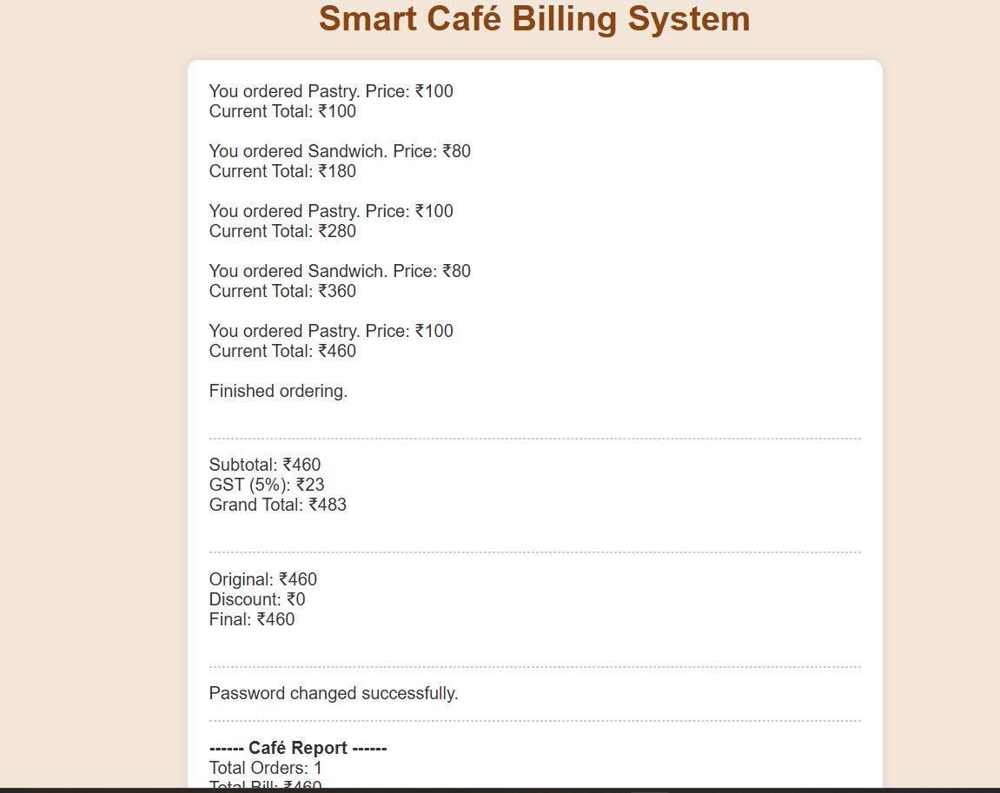
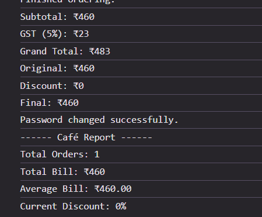

# Smart Café Billing System

## Description
Ye ek **beginner-friendly JavaScript project** hai jo café me order, billing, discount, password change aur report generate karne ka kaam karta hai.  
Project me **console.log()** aur **webpage output** dono ka use kiya gaya hai.  

### Features / Tasks:
1. **Place Order System**  
   - Users multiple items order kar sakte hai.  
   - Track karta hai: total bill, total items sold, highest & lowest priced item.  

2. **View Bill**  
   - Subtotal, GST (5%) aur Grand Total calculate karta hai.  

3. **Apply Discount**  
   - Subtotal > 1000 → 20% discount  
   - Subtotal > 500 → 10% discount  
   - Else → No discount  

4. **Change Café Password**  
   - Default password: `1234`  
   - Old password check karke new password update karta hai.  

5. **View Café Report**  
   - Total items sold  
   - Highest price item  
   - Lowest price item  
   - Average item price  

---

## How to Use
1. Download `index.html` and `script.js` in same folder.  
2. Open `index.html` in browser.  
3. Follow prompts for ordering, billing, password change and report.  

---

## Screenshots
Place your screenshots of the output here.

Example:

  
  
  

> Note: Screenshots folder should be in the same repo, path: `/screenshots/`

---

## Technologies Used
- HTML  
- CSS (basic styling)  
- JavaScript (variables, loops, if-else, prompt, console.log, DOM manipulation)

---

## Author
Israr Shaikh
