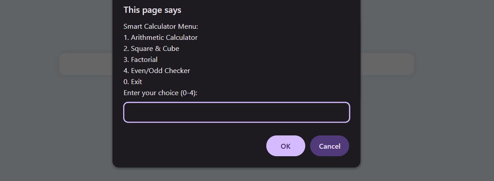
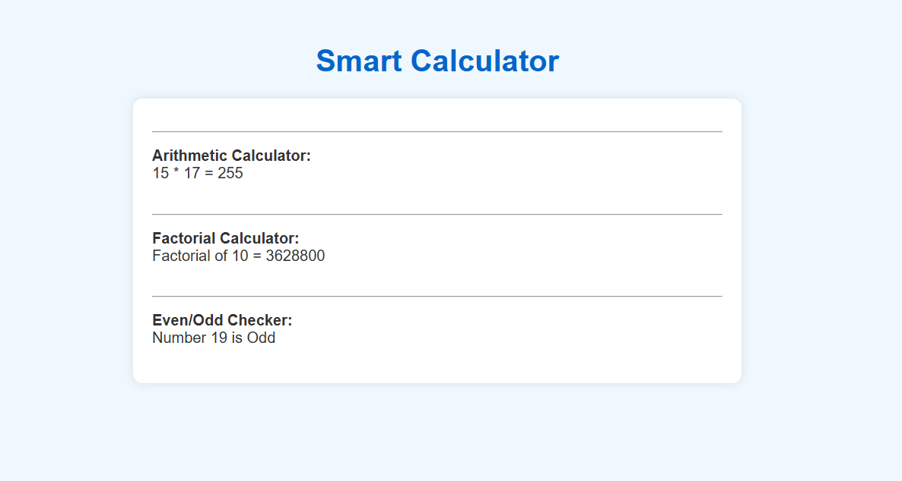

# Smart Calculator

## Description
Ye ek **menu-driven JavaScript project** hai jo user ko multiple arithmetic operations perform karne deta hai.  
Project me **user-defined functions (UDFs)**, loops, recursion, conditional statements, aur DOM output methods ka use kiya gaya hai.  

### Features / Tasks:
1. **Arithmetic Calculator**  
   - 2 numbers aur operator (+, -, *, /, %) input lete hai.  
   - Function ke through calculation hota hai.  
   - Result console aur webpage dono me dikhata hai.

2. **Square & Cube Calculator**  
   - Ek number input lete hai.  
   - `calculateSquare()` aur `calculateCube()` functions use karte hai.  
   - Result console aur webpage me show hota hai.

3. **Factorial Calculator**  
   - Ek number input lete hai.  
   - Recursive function se factorial calculate hota hai.  
   - Result console aur webpage me show hota hai.

4. **Even/Odd Checker**  
   - Ek number input lete hai.  
   - Function se check karte hai ki number Even hai ya Odd.  
   - Result console aur webpage me show hota hai.

---

## How to Use
1. Download `index.html` and `script.js` in same folder.  
2. Open `index.html` in browser.  
3. Menu select karke operations perform kare.  
4. Results **console** aur **webpage** dono me dikhai denge.

---

## Screenshots
> Add your screenshots here by updating the paths

**Example:**

## Technologies Used
- HTML  
- CSS (basic styling)  
- JavaScript (variables, loops, conditional statements, functions, recursion, DOM manipulation)  

---

## Author
Israr Shaikh
