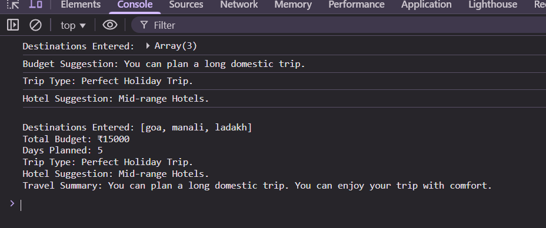

# Smart Travel Planner

## Description
Ye ek **JavaScript-based travel planning project** hai jo user ko travel destinations, budget, aur days ke hisaab se suggestions deta hai.  
Project me **arrays, loops, functions, ES6 features**, aur conditional statements ka use kiya gaya hai.  

### Features / Tasks:
1. **Destination Input**  
   - User 3 destinations input karta hai.  
   - Array me store aur console me display hota hai.

2. **Budget Check**  
   - User total budget input karta hai.  
   - Conditional statements ke through trip type suggest hota hai:  
     - `< ₹10,000` → Short domestic trip  
     - `₹10,000 – ₹50,000` → Long domestic trip  
     - `> ₹50,000` → International trip possible

3. **Travel Days Calculator**  
   - User number of travel days input karta hai.  
   - Conditional statements se trip duration type suggest hota hai:  
     - `< 3` → Weekend Getaway  
     - `3–7` → Perfect Holiday Trip  
     - `> 7` → Extended Vacation

4. **Hotel Suggestion Function**  
   - Budget per day calculate karke hotel type suggest hota hai:  
     - `< ₹2000` → Budget Hotels  
     - `₹2000 – ₹5000` → Mid-range Hotels  
     - `> ₹5000` → Luxury Hotels

5. **Final Travel Summary**  
   - Template literals se **destinations, budget, days, trip type, hotel suggestion aur message** display hota hai.  
   - Console + Webpage dono me show hota hai.

---

## How to Use
1. Download `index.html` and `script.js` in same folder.  
2. Open `index.html` in browser.  
3. Prompt ke through destinations, budget aur travel days enter kare.  
4. Results **console** aur **webpage** dono me dikhai denge.

---

## Screenshots
> Add your screenshots here by updating the paths

**Example:**

> Note: Create a folder `/screenshots` in the repo and put images there.  

---

## Technologies Used
- HTML  
- CSS (basic styling)  
- JavaScript (arrays, loops, conditional statements, functions, ES6 template literals)  

---

## Author
Israr Shaikh
