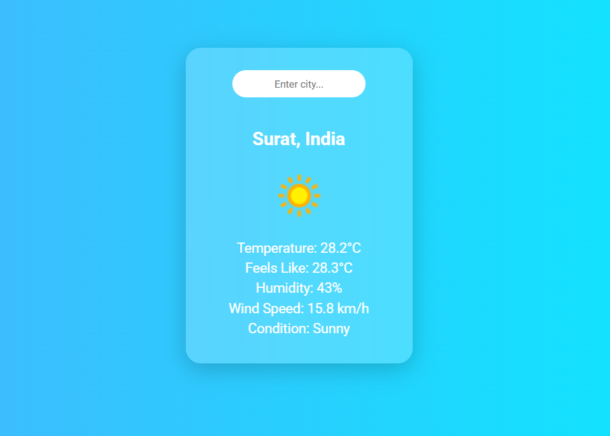

# Weather App

A **cool and responsive Weather App** built using **HTML, CSS, and JavaScript**, which fetches real-time weather data from [WeatherAPI](https://www.weatherapi.com/) using an API key. The app displays temperature, feels-like temperature, humidity, wind speed, and weather conditions with dynamic backgrounds based on the current weather.

---

## Features

- Search for any city to get real-time weather information.
- Displays:
  - City name & country
  - Temperature
  - Feels like temperature
  - Humidity
  - Wind speed
  - Weather condition & icon
- Dynamic background changes according to temperature.
- Default weather shown for **London** on page load.
- Responsive and visually appealing glass card UI.

---

## Demo

  
*(Replace with your own screenshot of the app)*

---

## Technologies Used

- HTML5
- CSS3 (Flexbox & Glassmorphism)
- JavaScript (Fetch API & DOM Manipulation)
- WeatherAPI for real-time weather data

---

## Setup & Usage

1. **Clone the repository** or download the files:

   ```bash
   git clone https://github.com/yourusername/weather-app.git
